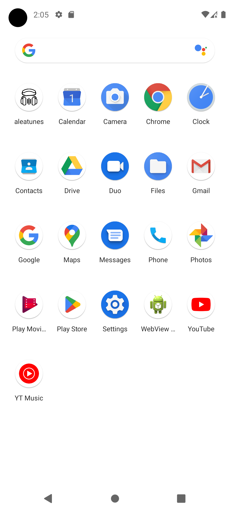
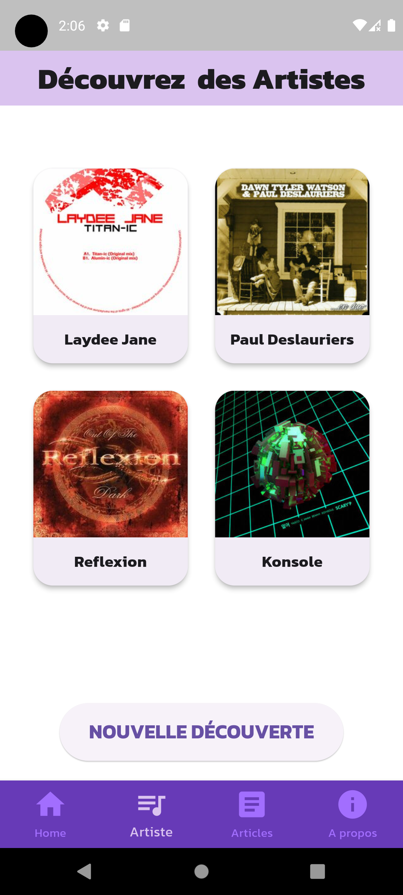
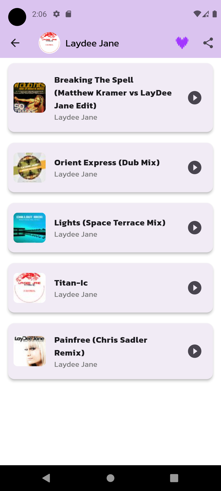
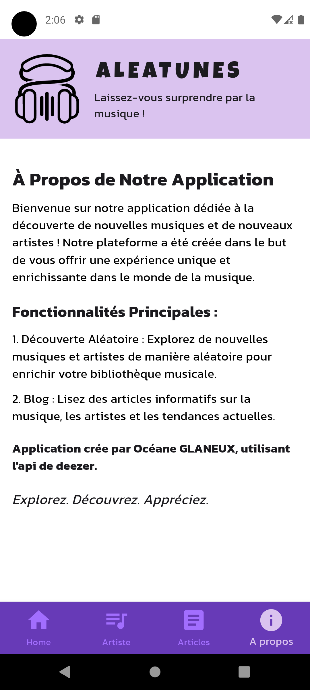

# Aleatunes

Aleatunes est une application Flutter permettant de découvrir des artistes et des musiques de manière aléatoire. 

## Fonctionnalité +

### Découvrir des artistes et musiques en aléatoire

Aleatunes permet aux utilisateurs de découvrir de nouveaux artistes et morceaux de manière aléatoire et d'en écouter un extrait. Cette fonctionnalité unique offre une expérience de découverte musicale surprenante et enrichissante.

## API Utilisée

Aleatunes utilise l'API suivante pour récupérer les informations sur les artistes et les musiques :

- [API de Deezer](https://developers.deezer.com/api)

## Post Mortem

### Ce qui a bien fonctionné
- **Fonctionnalité de découverte aléatoire** 

### Ce qui pourrait être amélioré
- **Interface utilisateur** 

## Application :

